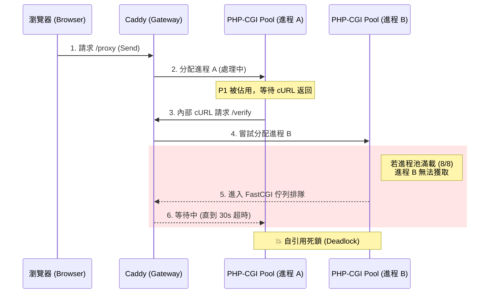

# 技術分析報告：PHP-CGI 進程池耗盡與自引用死鎖

## 1. 現象描述 (Symptoms)

在前端 Laravel Web 應用程式的 **JS API Tester** 工具中，快速連續點擊「Send」按鈕時發生請求超時。

*   **測試環境**：`https://local-api.domain.xyz/`
*   **測試動作**：連續對 `/token/verify` 發起請求。
*   **錯誤表現**：前 7 次請求正常，第 8 次請求觸發 `cURL error 28: Operation timed out`（等待超過 30 秒，0 bytes received）。

---

## 2. 關鍵數據分析 (Evidence)

透過 Caddy 的 `access.log` 還原請求時間線，發現 PHP 執行時間與網頁總耗時存在巨大差異：

| 請求路徑 | Caddy 報告總耗時 | PHP 實際執行時間 (X-Execution-Time) | 佇列等待時間 (Queue Time) | 狀態 |
| :--- | :--- | :--- | :--- | :--- |
| `/test/.../proxy` | **30.60 秒** | N/A (被內部 cURL 卡住) | ~0 秒 | ❌ 超時 |
| `/token/verify` | **30.56 秒** | **138.43 ms** | **30.42 秒** | ⚠️ 排隊成功但太遲 |

### 🔍 數據推論
PHP 本身處理僅需 138 毫秒，但請求在 Caddy 的 FastCGI 佇列中整整排隊了 30.4 秒。這證明了 **PHP-CGI 進程池已完全飽和**，導致後續請求無法獲得處理進程。

---

## 3. 根本原因：自引用死鎖 (Self-Referencing Deadlock)

WinCMP 的架構中存在一個結構性缺陷：**應用程式對同一組進程池發起遞迴呼叫**。

### 3.1 死鎖成因
1.  **資源佔用**：瀏覽器請求 `proxy` 介面，佔用了一個 `php-cgi` 進程。
2.  **遞迴請求**：`proxy` 內部透過 cURL 再次請求同一個 Caddy 上的 `verify` 介面。
3.  **資源競爭**：`verify` 請求需要**另一個**空閒的 `php-cgi` 進程。
4.  **連鎖效應**：當併發請求增加，所有 8 個進程都被 `proxy` 佔用並在等待內部的 `verify` 返回時，系統進入完全死鎖。

### 3.2 視覺化流程圖

---

## 4. 為什麼第 8 次才失敗？

雖然進程池有 8 個，但這並非單純的數值問題：
*   **連線池回收時差**：Windows TCP `TIME_WAIT` 回收延遲。
*   **FastCGI 持久連線**：Caddy 與 FastCGI 之間的連線池回收需要時間。
*   **併發波動**：當第 7-8 次 Send 同時進來時，系統剛好耗盡了所有可用 Workers 且尚未釋放舊資源。

---

## 5. 建議解決方法 (Recommendations)

詳細評估請參閱 [System_design_document.md](System_design_document.md#9-緩解方案評估)。

1.  **短期應急**：在 WinCMP 設定中將 PHP-CGI 進程數調高至 **16 以上**。
2.  **架構優化 (最推薦)**：修改 Laravel 代碼，將內部的 cURL 請求改為直接的 **Service/Repository 函式呼叫**，避免走網絡層。
3.  **環境分流**：為 API 服務配置獨立的 PHP-CGI 進程池。

---
> **文件歸檔標記**：本次問題已還原鐵證，確認為架構性資源死鎖，非代碼 Bug。
