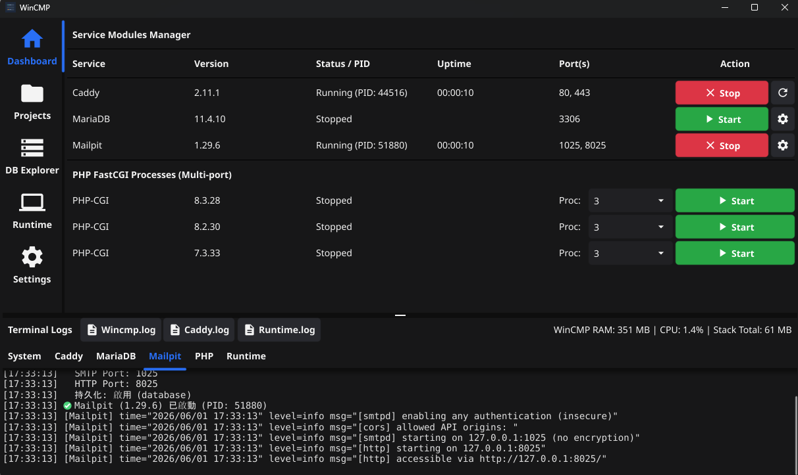

# WinCMP 🚀


**WinCMP** is a modern, portable local development environment control panel designed specifically for Windows. 
The name is derived from **Win**dows + **C**addy + **M**ariaDB + **P**HP.

Inspired by XAMPP and Laragon, WinCMP aims to provide a more lightweight, **portable (no installation required)**, and **mostly admin-privilege-free** development solution (excluding optional Hosts file modifications). Built with Go and the Fyne GUI framework, it features extremely low resource usage and fast startup speeds.

---

## 📸 Preview



---

## ✨ Features

- 🪶 **Extremely Lightweight**: Statically compiled in Go, no Electron dependency.
- 🛡️ **No Admin Privileges Needed for Core Services**: Fully supports running under restricted environments without modifying system environment variables or writing to the registry. *(Note: Automatic writing to the Windows `hosts` file for custom domains is optional and requires Administrator elevation/UAC prompt).*
- 🎨 **Modern UI/UX**: Built-in Dark/Light modes with smooth sidebar navigation and real-time status monitoring.
- 🔄 **PHP Multi-Process Load Balancing**: Leverages Caddy's upstream mechanism to run multiple FastCGI processes for each PHP version.
- 📂 **Automated Project Management**: Visually manage Laravel, Next.js, Nuxt, Astro, Vite, Python, Go, and other projects. Automatically detects frameworks and generates configurations.
- 🚀 **Runtime Multi-Environment Execution**: Supports Node.js, Bun, Python, Go (Air/Run), and Custom development environments, with options to start in Background or Terminal mode.
- 📜 **Isolated Environments**: Dynamically injects `PATH` when launching subprocesses to ensure PHP and its extensions run in the correct binary environments.

---

## 📁 Project Architecture & Directory Layout

To achieve "plug-and-play" simplicity, WinCMP strictly adheres to the following directory structure:

```text
wincmp/
├── wincmp.exe               # Go compiled main executable
├── conf/                    # Configuration center
│   ├── ssl/                 # SSL Certificates (crt/key)
│   ├── snippets/            # Shared Caddy configuration snippets
│   ├── sites/               # Dynamically generated project Caddyfiles
│   ├── wincmp.json          # WinCMP global & project configurations (UI data source)
│   ├── Caddyfile            # Caddy entry point (Imports snippets & sites)
│   └── my.ini               # MariaDB initialization config
├── bin/                     # Binary executables directory (pre-included or auto-scanned)
│   ├── caddy/               # caddy-x.xx.x/caddy.exe
│   ├── mariadb/             # mariadb-x.x.x/bin/mariadbd.exe
│   ├── php/                 # php-x.x.x/php-cgi.exe
│   ├── node/                # node-x.x.x/npm.cmd
│   ├── bun/                 # bun-x.x.x/bun.exe
│   ├── composer/            # composer-x.x.x/composer.bat
│   ├── heidisql/            # heidisql-x.xx/heidisql.exe
│   └── mailpit/             # mailpit-x.xx.x/mailpit.exe
├── data/                    # Data storage
│   └── mariadb/             # Default MariaDB data directory
├── logs/                    # Service execution logs (grouped by date)
├── www/                     # Default web projects root directory
├── internal/                # Core logic
│   ├── config/              # JSON configuration reader/writer
│   ├── scanner/             # Dynamic version scanning for the bin directory
│   ├── process/             # Subprocess lifecycle management (Manager)
│   ├── detect/              # Laravel project detection (confidence-score based)
│   ├── preset/              # Project preset system (framework detection & command templates)
│   ├── hosts/               # Windows Hosts file manager
│   ├── port/                # Port occupation checker
│   ├── resource/            # Resource monitoring (CPU/RAM/Subprocess stack)
│   ├── crypto/              # MariaDB password encryption
│   └── singleinstance/      # Single instance lock + window focus helper
├── ui_runtime.go            # Runtime Tab UI definition
├── bundled_icon.go          # Application icon resources
└── bat/                     # Startup scripts for backup (testing reference)
```

---

## 🛠️ Architecture & Under-the-Hood Logic

### 1. PHP Process Management & Port Mapping
WinCMP utilizes a **3-version-sequence** pattern to assign service ports, ensuring different versions of PHP can run concurrently without conflicts:
- **Naming Convention**: `3<Major><Minor><Sequence 00-99>`
  - PHP 7.3 → `37300`, `37301`, `37302`
  - PHP 8.2 → `38200`, `38201`, `38202`
- **Load Balancing**: Each PHP version starts 3 `php-cgi` processes by default. WinCMP defines `php_fastcgi 127.0.0.1:38200 127.0.0.1:38201 ...` in Caddyfile to balance the requests.

### 2. Dynamic Caddy Configuration
When a user updates project settings in the UI:
1. `conf/wincmp.json` is updated.
2. The Go application rewrites `conf/sites/{project}.caddy`.
3. Calls `caddy reload` for a zero-downtime hot reload.

### 3. Dynamic Environment Variables Injection
To avoid modifying the system's global `PATH`, WinCMP prepends the corresponding binary directories to the subprocess's `Env` list via `os/exec` (e.g., when launching PHP), ensuring that extensions and dependencies locate their correct DLLs.

---

## 🚀 Development & Compilation

### 1. Prerequisites
- [Go 1.26.2+](https://go.dev/dl/)
- C Compiler (required for Fyne Cgo dependency)

### 2. Admin-Privilege-Free Compilation (Using WinLibs)
If you cannot install MSYS2 on your system:
1. Download the zip version of [WinLibs MinGW-w64](https://winlibs.com/).
2. Extract it and add the `bin/` folder to your **User Path variables**.
3. Verify that `gcc -v` works in your shell.

### 3. Build Commands
```cmd
# Initialize dependencies
go mod tidy

# Standard build
go build -v -o wincmp.exe .

# Release build (No CMD window console)
go build -v -o wincmp.exe -ldflags "-H windowsgui" .

# Compact release build (Stripped symbols)
go build -ldflags "-H windowsgui -s -w" -o wincmp.exe .

# Package using Fyne (Includes icons and resources)
fyne package -release

# If packaging fails, clear cache first
go clean -cache
```

---

## 🗺️ Roadmap

### ✅ Completed
- [x] Modern UI prototype and project management interface.
- [x] Multi-tab system logs with log-rotation mechanism.
- [x] MariaDB scanning and database viewer.
- [x] Multi-process PHP load balancing for Caddy.
- [x] **Windows System Tray** minimization support.
- [x] **Resume Last Services**: Auto-starts services that were running when the app was closed (saved in `wincmp.json`).
- [x] **Service Uptime Tracker** (independent stats for Caddy, MariaDB, and PHP).
- [x] **Laravel Auto-Detection** (confidence score system, automatically routing to `public/`).
- [x] **Port Conflict Check** (runs checks before launch to minimize race conditions).
- [x] **Hosts File Auto-Management** (automatically syncs local domains after prompting for UAC elevation).
- [x] **Dark/Light Theme Toggle** (integrated with Fyne's theme system).
- [x] **Runtime Multi-Environment Support** (Node.js, Bun, Python, Go Air/Run, Custom).
- [x] **Framework Preset Auto-Detection** (Next.js, Nuxt, Astro, Vite, Django, FastAPI, Flask, PocketBase, Go API).
- [x] **Double Launch Mode for Runtimes** (Background / Terminal).
- [x] **Legacy Project Auto-Migration** (node_port → runtime_port, etc.).
- [x] **Mailpit Integration** (start/stop toggle on Dashboard and configuration dialog).

### ⏳ Planned
> **💡 For a detailed roadmap, technical analysis, and prioritization, please refer to the complete [Develop Task List](doc/develop_task_list.md).**

- **Deep OS Integration**: Windows auto-start on boot (`HKCU\Run`), one-click setup for Windows system environment path (`Path`).
- **Dev Toolchain**: Embedded Composer support (no `composer.phar` installation needed), PHP process watchdog with auto-recovery.
- **Advanced Service Manager**: HeidiSQL integration (preview & fast connection), automated downloader for service executables (Caddy/PHP/MariaDB multi-version).

---

## 📄 License

This project is licensed under the [MIT License](https://opensource.org/license/mit/).
Feel free to submit Pull Requests or open Issues to share your feedback!