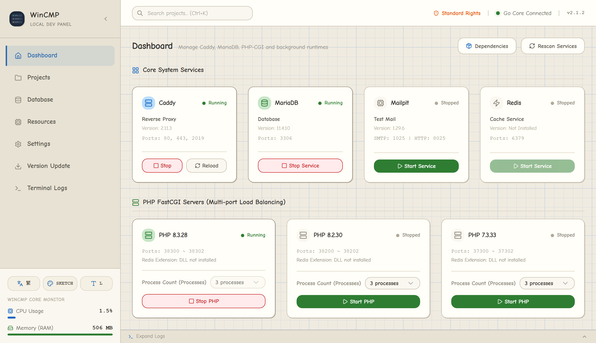

# WinCMP


**WinCMP** is a portable local development control panel for Windows.
The name stands for **Win**dows + **C**addy + **M**ariaDB + **P**HP.

Inspired by XAMPP and Laragon, but lighter: no installer, no system PATH pollution, and core services run without admin rights (Hosts sync is optional and needs UAC). Built with Go + Wails v2 and a React 18 UI.

**Download:** [GitHub Releases](https://github.com/wukh1124/wincmp/releases/latest)

---

## Preview



---

## Features

- **Lightweight single EXE** — Go + Wails, uses native WebView2 (not Electron). Idle UI memory is roughly 150–250MB.
- **Portable** — migrate with `conf/wincmp.json` + `/bin` only.
- **No admin for core services** — Caddy, PHP-CGI, MariaDB, Mailpit, Redis run in user space. *(Hosts sync and some dependency downloads may prompt UAC.)*
- **Modern UI** — dark / light themes, live service status, project terminal drawer.
- **PHP multi-process** — Caddy upstream load balancing; default 3 FastCGI processes per version (adjustable in Dashboard). Ports follow `3<major><minor><index>`.
- **Project presets** — auto-detect Laravel, Next.js, Nuxt, Astro, Vite, Django/FastAPI/Flask, PocketBase, Go API, etc.
- **Runtimes** — Node.js, Bun, Python, Go, Custom; Background or Terminal launch modes.
- **Built-in terminal** — ConPTY + xterm.js drawer (PowerShell / CMD / Git Bash / WSL) with TAB completion.
- **Dependency downloader** — fetch Caddy, PHP, MariaDB, Mailpit, Redis, Node.js, Bun, Composer, HeidiSQL into `/bin`.
- **DB tools** — built-in DB Explorer; open the same connection in HeidiSQL.
- **Env isolation** — injects `PATH` per subprocess instead of rewriting system variables.
- **Hot reload** — project settings write to `conf/sites/` and reload Caddy without restarting the panel.

---

## Layout

```text
wincmp/
├── main.go / app.go / bridge.go
├── downloader_bridge.go
├── conf/
│   ├── wincmp.json          # main config (projects + global)
│   ├── Caddyfile
│   ├── my.ini
│   ├── dependencies.json    # downloader catalog
│   ├── snippets/  sites/  ssl/
├── bin/                     # service binaries (yours or downloaded)
│   ├── caddy/  mariadb/  php/
│   ├── mailpit/  redis/
│   ├── node/  bun/  composer/  heidisql/
├── data/mariadb/
├── logs/
├── www/
├── internal/                # config, scanner, process, detect, preset, hosts, ...
└── frontend/                # React + TypeScript
```

Config path used by the app: **`conf/wincmp.json`**.

---

## Architecture notes

**PHP ports** — `3<major><minor><sequence>`:
PHP 7.3 → `37300+`; PHP 8.2 → `38200+`. Default process count is 3 per version.

**Config apply** — UI updates `conf/wincmp.json` → rewrite `conf/sites/{project}.caddy` → `caddy reload`.

**PATH isolation** — binary dirs are prepended to the child process env only; system PATH is left untouched.

---

## Development

### Prerequisites

- Go 1.26.2+
- [Wails v2](https://wails.io/docs/gettingstarted/installation/)
- MinGW-w64 (WinLibs) so `gcc -v` works
- Node.js 18+

### Commands

#### 1. Build & Run

```bash
# Start local development with hot reload
wails dev

# Build (clean & optimized)
go mod tidy
cd frontend && npm install && cd ..
wails build -clean -ldflags "-s -w"

# Build with version tag (read dynamically from VERSION file)
# PowerShell:
$ver = (Get-Content VERSION).Trim(); wails build -clean -ldflags "-s -w -X main.AppVersion=v$ver"

# Automated release packaging (creates zip & exe with checksums in ../wincmp-release-only/)
.\release.bat
```

#### 2. Screenshots (Headless Playwright)

```bash
# Capture screenshots with auto backup of previous version (requires `wails dev` running)
node scripts/capture.js

# Capture screenshots and automatically sync to website folder
node scripts/capture.js --sync-website
```

#### 3. Website Local Preview & Sync

```bash
# Sync icon, screenshots, and generate website/release.json for local website testing
node scripts/sync-website.js

# Or generate website/release.json only (automatically run in CI)
node scripts/generate-release-json.js
```

End-user install docs live in [`packaging/wincmp/readme.md`](packaging/wincmp/readme.md).

---

## Roadmap

### Done

- Wails + React UI, multi-tab logs, system tray, resume last services
- MariaDB scan, DB Explorer + HeidiSQL, hosts sync with backup
- PHP multi-process balancing, runtime multi-env, framework presets
- Project terminal (ConPTY + xterm.js), Mailpit, Redis + PHP Redis ext
- Dependency downloader (Caddy/PHP/MariaDB/Node/Bun/Composer/HeidiSQL/Mailpit/Redis)
- PHP OPcache auto-tuning, project drag-and-drop order

### Planned

- PHP process watchdog / auto-recovery

---

## Credits

- [Go](https://go.dev/), [Wails v2](https://wails.io/), [React 18](https://react.dev/)
- [Windows ConPTY](https://learn.microsoft.com/windows/console/pseudoconsole), [xterm.js](https://xtermjs.org/)
- Managed stacks: Caddy, MariaDB, PHP, Mailpit, Redis
- Theme inspiration: [Open Design](https://github.com/nexu-io/open-design)

## License

[MIT](LICENSE)
